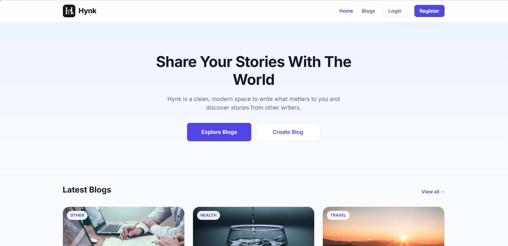
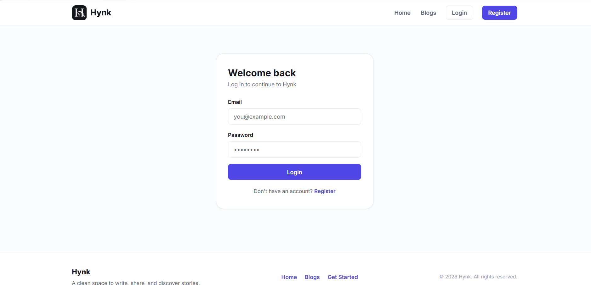
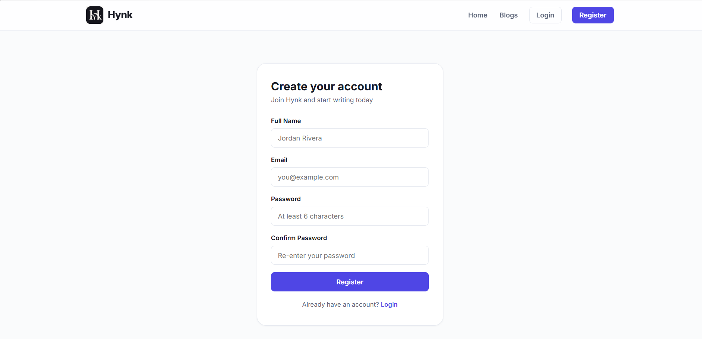
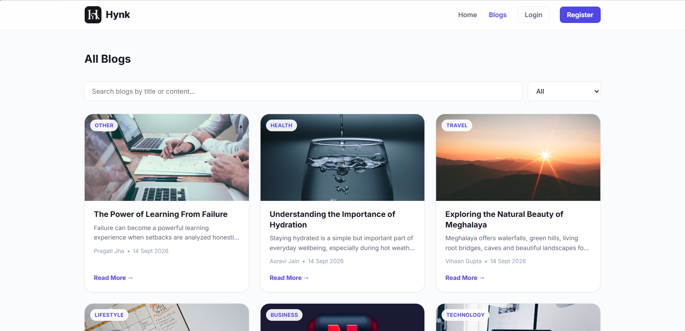
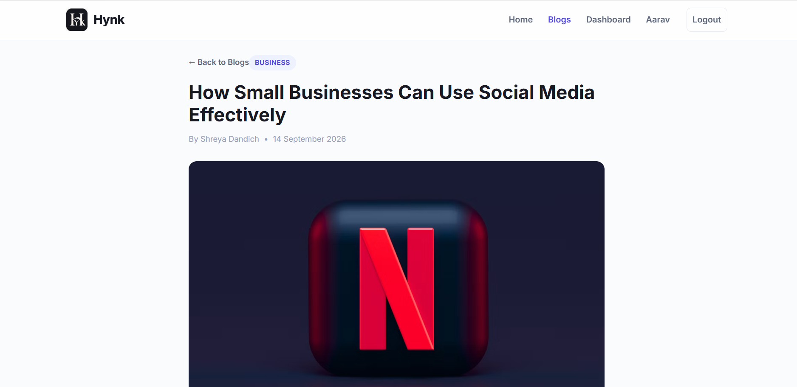
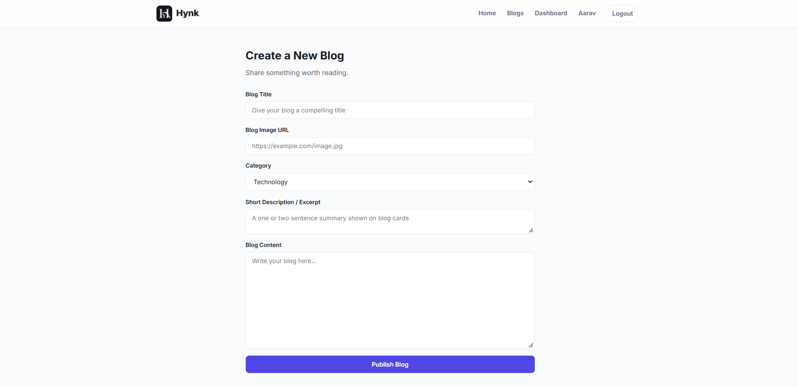
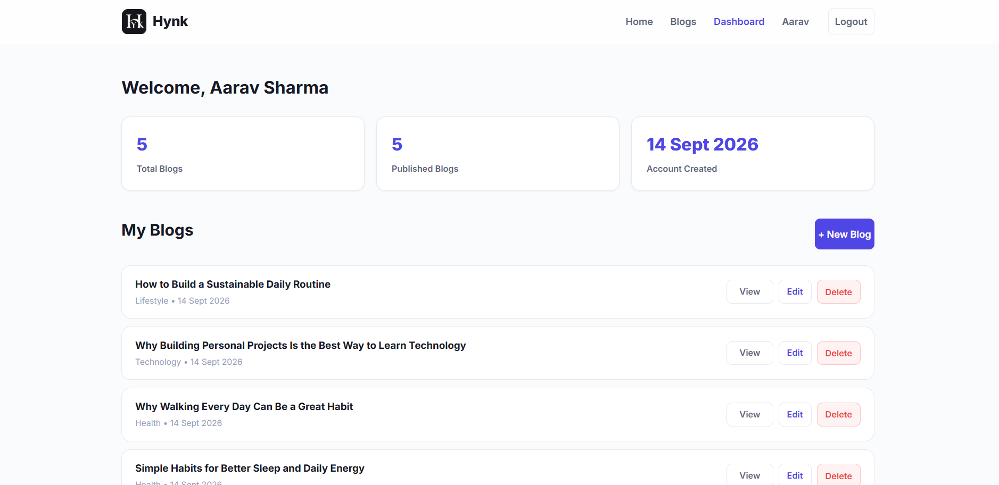
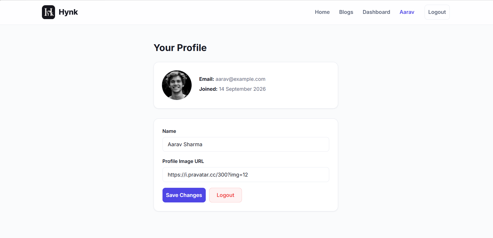

# ✍️ Hynk — Full Stack Blog Application

> A modern full-stack blogging platform to write, share, and discover stories.

Hynk is a responsive MERN-stack blog application where users can create an
account, publish blogs, explore content from other writers, and manage their
own posts from a personal dashboard.

The project focuses on building a complete real-world web application with
authentication, protected routes, CRUD operations, search, category filtering,
user profiles, and a MongoDB-backed API.

> **Think. Write. Share.**

---

## ✨ Features

### 🔐 Authentication

- User registration and login
- JWT-based authentication
- Secure password hashing with bcryptjs
- Persistent login session
- Protected routes
- Automatic handling of expired or invalid sessions
- Logout functionality

### 📝 Blog Management

- Create new blog posts
- Edit your own blogs
- Delete your own blogs
- View individual blog details
- Ownership-based edit and delete permissions
- Blog cover images through image URLs
- Categories for organizing content
- Automatic creation and update timestamps

### 🔎 Explore Blogs

- Browse all published blogs
- Search blogs by title and content
- Filter blogs by category
- Paginated blog listing
- Responsive blog card layout
- View blogs written by different users

### 👤 User Dashboard

- View personal blog statistics
- View account creation date
- View all personally created blogs
- Quickly view, edit, or delete posts
- Manage personal blog content from one place

### 👤 Profile

- View account information
- Update display name
- Update profile image
- View email and account information
- View account creation details

### 🎨 User Experience

- Clean and modern interface
- Fully responsive design
- Desktop, tablet, and mobile layouts
- Loading states
- Empty states
- Toast notifications
- Delete confirmation dialog
- Custom 404 page
- Responsive navigation menu

---

## 🛠️ Tech Stack

| Layer | Technology |
|---|---|
| Frontend | React 18, Vite |
| Routing | React Router |
| HTTP Client | Axios |
| Styling | CSS |
| Backend | Node.js, Express.js |
| Database | MongoDB |
| ODM | Mongoose |
| Authentication | JSON Web Token (JWT) |
| Password Security | bcryptjs |

---

## 🏗️ Application Architecture

```text
┌──────────────────────┐
│      React + Vite    │
│       Frontend       │
└──────────┬───────────┘
           │
           │ Axios / REST API
           ▼
┌──────────────────────┐
│      Express.js      │
│       Backend        │
└──────────┬───────────┘
           │
           │ Mongoose
           ▼
┌──────────────────────┐
│       MongoDB        │
│      Database        │
└──────────────────────┘
```

---

## 🌐 Live Demo

- **Frontend:** Add your deployed frontend URL here
- **Backend API:** Add your deployed backend URL here
- **Repository:** https://github.com/heenameetscode/Hynk-BlogApplication

> **Note:** The backend is hosted on a free-tier service, so the first
> request may take some time if the server is inactive.

---

## 📸 Project Screenshots

### 🏠 Home Page



### 🔐 Login



### 📝 Register



### 📚 Blogs



### 📖 Blog Details



### ✍️ Create Blog



### 📊 Dashboard



### 👤 Profile



---

## 🌟 Project Highlights

- Full-stack MERN blogging application
- Real MongoDB database integration
- JWT-based user authentication
- Secure password hashing using bcryptjs
- Protected frontend and backend routes
- Ownership-based authorization for blog posts
- Search functionality across blog title and content
- Category-based blog filtering
- Personal dashboard for blog management
- Profile management with profile image support
- RESTful API architecture
- Responsive design for all screen sizes
- Clean separation between frontend and backend
- Complete CRUD operations for blog posts

---

## 📁 Project Structure

```text
Hynk/
│
├── client/
│   ├── public/
│   └── src/
│       ├── components/
│       ├── context/
│       ├── pages/
│       ├── services/
│       ├── App.jsx
│       └── main.jsx
│
├── server/
│   ├── controllers/
│   ├── middleware/
│   ├── models/
│   ├── routes/
│   ├── config/
│   ├── server.js
│   └── package.json
│
├── screenshots/
│   ├── home.png
│   ├── login.png
│   ├── register.png
│   ├── blogs.png
│   ├── blog-details.png
│   ├── create-blog.png
│   ├── dashboard.png
│   └── profile.png
│
└── README.md
```

---

## ⚙️ Installation

### 1. Clone the Repository

```bash
git clone YOUR_GITHUB_REPOSITORY_URL
```

### 2. Move into the Project Directory

```bash
cd Hynk
```

### 3. Install Backend Dependencies

```bash
cd server
npm install
```

### 4. Install Frontend Dependencies

```bash
cd ../client
npm install
```

---

## 🔑 Environment Variables

### Backend

Create a `.env` file inside the `server` folder:

```env
MONGO_URI=your_mongodb_connection_string
JWT_SECRET=your_jwt_secret
JWT_EXPIRES_IN=7d
PORT=5000
CLIENT_ORIGIN=http://localhost:5173
```

### Frontend

Create a `.env` file inside the `client` folder:

```env
VITE_API_URL=http://localhost:5000/api
```

> **Important:** Never commit `.env` files or secret keys to GitHub.

---

## ▶️ Running the Application

### Start the Backend

Open a terminal and run:

```bash
cd server
npm run dev
```

The backend will run on:

```text
http://localhost:5000
```

### Start the Frontend

Open another terminal and run:

```bash
cd client
npm run dev
```

The frontend will run on:

```text
http://localhost:5173
```

---

## 📡 API Endpoints

### Authentication

```text
POST   /api/auth/register
POST   /api/auth/login
POST   /api/auth/logout
GET    /api/auth/me
```

### Blogs

```text
GET    /api/blogs
GET    /api/blogs/mine
GET    /api/blogs/:id
POST   /api/blogs
PUT    /api/blogs/:id
DELETE /api/blogs/:id
```

### Users

```text
GET    /api/users/profile
PUT    /api/users/profile
```

Protected routes require authentication using:

```text
Authorization: Bearer <token>
```

---

## 🔐 Authentication and Authorization

Hynk uses JWT-based authentication to securely manage user sessions.

When a user logs in successfully:

1. The server validates the user's credentials.
2. A JWT token is generated.
3. The token is stored on the client side.
4. Protected requests include the token.
5. The backend verifies the token before allowing access.

Blog ownership is also enforced.

Users can:

- Create their own blogs
- Edit their own blogs
- Delete their own blogs

Users cannot modify or delete blogs belonging to other users.

---

## 🗄️ Database

Hynk uses MongoDB with Mongoose for database management.

### User Collection

Stores:

- Name
- Email
- Hashed password
- Profile image
- Account creation date
- Updated date

### Blog Collection

Stores:

- Title
- Content
- Excerpt
- Cover image
- Category
- Author reference
- Creation date
- Updated date

Blog posts are connected to their respective authors using MongoDB ObjectId
references.

---

## 📱 Responsive Design

Hynk is designed to work across different screen sizes.

The interface adapts to:

- Desktop
- Tablet
- Mobile

The blog grid uses multiple columns on larger screens and automatically
adjusts to smaller layouts on mobile devices.

---

## 📚 Skills Gained

This project helped me gain practical experience in:

- Building a full-stack MERN application
- Developing RESTful APIs with Express.js
- Working with MongoDB and Mongoose
- Implementing JWT authentication
- Password hashing using bcryptjs
- Creating protected routes
- Implementing ownership-based authorization
- Managing authentication state in React
- Using React Router for navigation
- Making API requests using Axios
- Implementing search and filtering functionality
- Building responsive user interfaces
- Managing CRUD operations
- Handling loading and error states
- Connecting frontend and backend applications
- Deploying and debugging full-stack applications

---

## 🔮 Future Enhancements

- ❤️ Likes and reactions
- 💬 Comments on blog posts
- 🔖 Bookmark or save blogs
- 📝 Rich text or Markdown editor
- 🖼️ Direct image upload
- 🔔 Real-time notifications
- 📧 Email verification
- 🔑 Password reset functionality
- 👥 Follow and following system
- 🌙 Dark mode
- 📊 Advanced user analytics
- 🛡️ Admin dashboard
- 🤖 AI-powered blog assistance

---

## 👩‍💻 Developed By

**Heena Dahiya**

Built as a full-stack web development project.

---

⭐ If you found this project interesting, consider giving the repository a star!